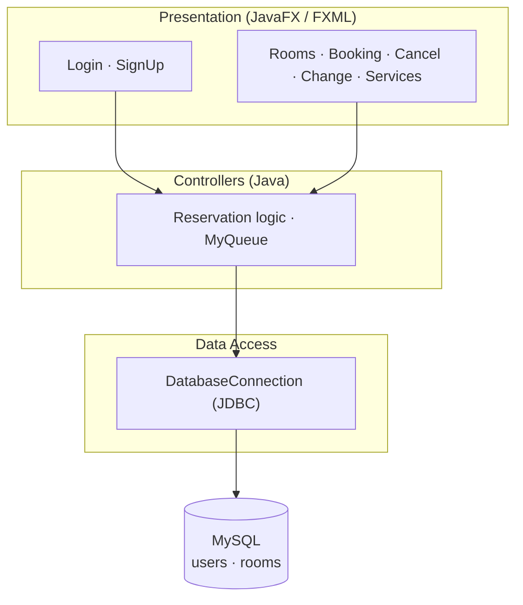

# 🏨 Hotel Reservation System (Otel Rezervasyon Sistemi)

<p>
  
  
  
  
  
</p>

A desktop **hotel reservation system** built with **JavaFX** (FXML UI), **Maven**, and a
**MySQL** backend. Users can sign up, log in, browse rooms and services, and create, change,
or cancel reservations through a multi-page graphical interface.

---

## ✨ Features

- 👤 **User accounts** — sign up, log in, and per-user session handling
- 🛏️ **Rooms** — browse available rooms and details
- 📅 **Reservations** — book, change, and cancel reservations
- 🍽️ **Services** — food list and sport/spa services
- 🗃️ **MySQL persistence** — rooms and users stored in a relational database
- 🧩 **Custom data structures** — a `MyQueue` implementation used in reservation flow

---

## 🏗️ Architecture



---

## 📁 Project Structure

```text
Otel_Rezervasyon_Sistemi/
├── otel/                          # SQL scripts
│   ├── otel_rezervasyon_rooms.sql
│   └── otel_rezervasyon_users.sql
└── Otel-Rezervasyon-Sistemi/      # Maven + JavaFX application
    ├── pom.xml
    └── src/main/
        ├── java/.../otelrezervasyonsistemi/   # Controllers & logic
        └── resources/.../                     # FXML views
```

---

## 🗄️ Database Setup

1. Install and start **MySQL**.
2. Create the database and import the provided scripts:

   ```bash
   mysql -u root -p -e "CREATE DATABASE otel_rezervasyon;"
   mysql -u root -p otel_rezervasyon < Otel_Rezervasyon_Sistemi/otel/otel_rezervasyon_users.sql
   mysql -u root -p otel_rezervasyon < Otel_Rezervasyon_Sistemi/otel/otel_rezervasyon_rooms.sql
   ```

3. Update your database credentials in
   `.../otelrezervasyonsistemi/DatabaseConnection.java`
   (`databaseName`, `databaseUser`, `databasePassword`) to match your local MySQL setup.

---

## 🚀 Build & Run

```bash
cd Otel_Rezervasyon_Sistemi/Otel-Rezervasyon-Sistemi

# Using the Maven wrapper (JavaFX plugin)
./mvnw clean javafx:run        # Windows: mvnw.cmd clean javafx:run
```

Requires **JDK 17+** (JavaFX). The entry point is `Main.java`.

---

## 🛠️ Tech Stack

- **Java** + **JavaFX** (FXML-based UI)
- **Maven** build system (with `mvnw` wrapper)
- **MySQL** via JDBC (`com.mysql.cj.jdbc.Driver`)

---

## 📄 License

Released under the [MIT License](LICENSE).
